# [Station Météo Embarquée](https://mr22206.github.io/3W_Electron_App/)

## Table des matières
1. [Introduction](#introduction)
2. [Installation](#installation)
3. [Utilisation de l'application](#utilisation-de-lapplication)
   - [Débogage et Téléversement](#débogage-et-téléversement)
   - [Récupération des Données](#récupération-des-données)
4. [Résolution des problèmes courants](#résolution-des-problèmes-courants)
5. [Support](#support)

## Introduction

### Vue d'ensemble du système
La Station Météo Embarquée se compose de deux parties principales :
1. **Le matériel** : Station météo basée sur Arduino
   - Arduino UNO
   - Capteurs (température, humidité, GPS, etc.)
   - Module SD pour le stockage
   
   <!--  -->

2. **Le logiciel** : Application de gestion
   - Interface utilisateur intuitive
   - Outils de programmation automatisés
   - Convertisseur de données

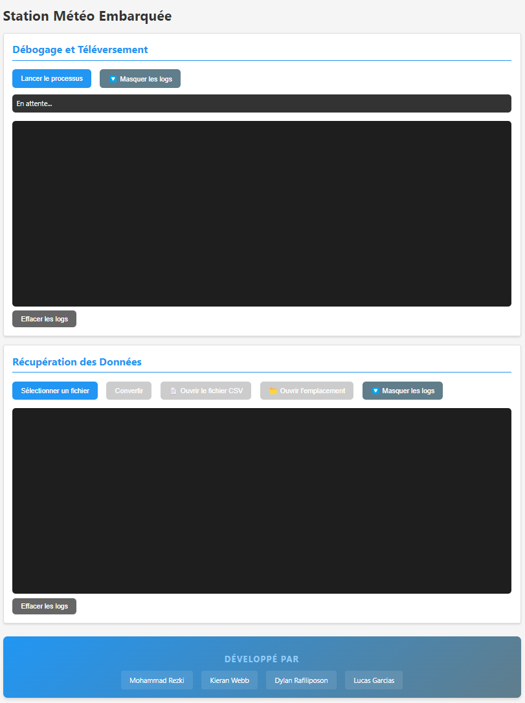

### Fonctionnalités principales
- Programmer facilement une station météo Arduino
- Récupérer et convertir les données météorologiques collectées
- Visualiser les logs et suivre le processus d'installation

## Installation

### Prérequis matériels détaillés
1. **Arduino UNO** 🎛️
   - Version recommandée : R3 ou ultérieure
   - Port USB type B fonctionnel
   - Tension d'alimentation : 5V
   - Fréquence : 16 MHz

   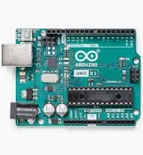

2. **Carte SD** 💾
   - Capacité : 32 Go maximum
   - Format : FAT32
   - Classe de vitesse : Classe 10 recommandée
   - Module SD compatible SPI
   - Tension : 5V (via Arduino)

   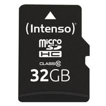

3. **Capteur BME280** 🌡️
   - Interface I2C
   - Tension : 3.3V ou 5V
   - Précision température : ±1°C
   - Précision humidité : ±3%
   - Précision pression : ±1 hPa

   > 💡 **Note** : Compatible directement en 5V avec l'Arduino

4. **Module GPS NEO-6M** 📍
   - Interface série (UART)
   - Tension : 5V (alimentation directe via Arduino)
   - Antenne céramique intégrée
   - Précision : jusqu'à 2.5m
   - Vitesse de transmission : 9600 baud
   
   > ✅ **Avantage** : Pas besoin de convertisseur de niveau, fonctionne directement en 5V

5. **Composants additionnels** 🔧
   - Horloge RTC DS1307
     - Interface I2C
     - Tension : 5V
     - Pile CR2032 pour la sauvegarde
   - Câbles de connexion
     - Jumpers mâle-femelle
     - Jumpers femelle-femelle
   - Résistances pull-up (déjà intégrées sur Arduino)

6. **Configuration système requise** 💻
   - Windows 10/11 (64 bits)
   - 4 Go RAM minimum
   - 500 Mo d'espace disque
   - 1 port USB disponible

### Schéma de connexion 🔌

| Composant | Pin Arduino | Description |
|-----------|------------|-------------|
| **Module SD** | | |
| MOSI | 11 | Data Out |
| MISO | 12 | Data In |
| SCK | 13 | Clock |
| CS | 4 | Chip Select |
| VCC | 5V | Alimentation |
| GND | GND | Masse |
| **BME280** | | |
| SDA | A4 | Data I2C |
| SCL | A5 | Clock I2C |
| VCC | 5V | Alimentation |
| GND | GND | Masse |
| **GPS NEO-6M** | | |
| TX | 3 | Transmission |
| RX | 2 | Réception |
| VCC | 5V | Alimentation |
| GND | GND | Masse |
| **RTC DS1307** | | |
| SDA | A4 | Data I2C |
| SCL | A5 | Clock I2C |
| VCC | 5V | Alimentation |
| GND | GND | Masse |

> ⚡ **Alimentation** : Tous les composants sont alimentés en 5V directement via l'Arduino

### Vérification du montage 🔍

1. **Test d'alimentation**
   - LED power Arduino allumée
   - LED du module GPS clignotante
   - Écran du BME280 actif (si présent)

2. **Test de communication**
   - GPS : LED fix clignote (acquisition satellites)
   - SD : LED d'accès clignote lors des écritures
   - BME280 : Répond sur l'adresse I2C 0x76 ou 0x77
   - RTC : Maintient l'heure même après redémarrage

> 🛠️ **Dépannage** : En cas de problème, vérifiez :
> - Les connexions (soudures, câbles)
> - L'alimentation de chaque module
> - Les conflits d'adresse I2C
> - La qualité des câbles de connexion

### Guide d'installation pas à pas

#### 1. Téléchargement
- Rendez-vous sur [le lien de téléchargement](https://github.com/mr22206/3W_Electron_App.git)
- Téléchargez le fichier `StationMeteo-Setup.exe`

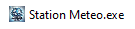

#### 2. Installation du logiciel
1. **Désactivation temporaire de l'antivirus**

   
   > 💡 **Aide :** Pour désactiver votre antivirus, consultez [ce guide détaillé](https://www.malekal.com/comment-desactiver-son-antivirus/)

2. **Installation de l'application**
   - Double-cliquez sur `StationMeteo-Setup.exe`
   - Dans l'assistant d'installation :
     1. Choisissez le type d'installation :
        - "Pour tous les utilisateurs" (nécessite les droits administrateur)
        - "Seulement pour l'utilisateur actuel"
    
      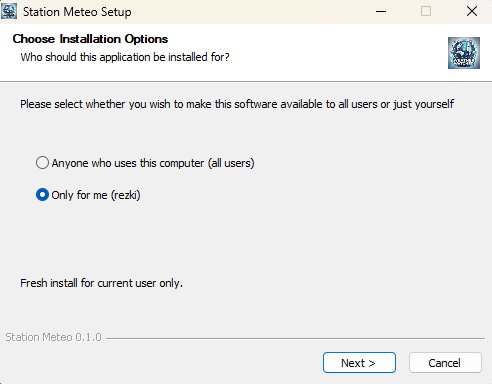
      
     2. Sélectionnez le dossier d'installation et cliquez sur "Installer"

      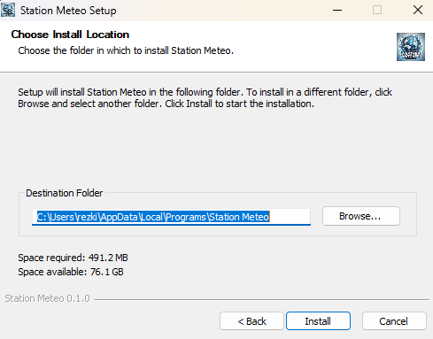

     3. À la fin de l'installation, cochez ou décochez "Lancer Station Météo Embarquée"
     4. Cliquez sur "Terminer"

     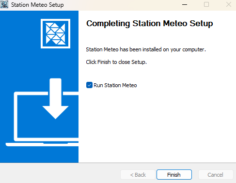

#### 3. Configuration du matériel

1. **Préparation de la carte SD**
   - Guide détaillé du formatage
   - Captures d'écran de l'utilitaire de formatage

   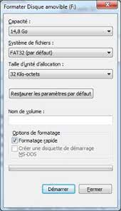
   
   > 💡 **Aide :** Pour formater votre carte SD en FAT32, consultez [ce guide détaillé](https://4ddig.tenorshare.com/fr/carte-sd/comment-formater-la-carte-sd-en-fat32-dans-windows-10-11.html)

2. **Installation des pilotes Arduino**
   1. **Installation automatique** (recommandée)
      - Branchez votre Arduino UNO à l'ordinateur
      - Windows installera automatiquement les pilotes
      - Attendez la notification "Le périphérique est prêt à être utilisé"

      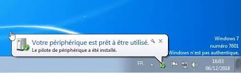

   2. **Installation manuelle** (si l'automatique échoue)
      - Téléchargez les pilotes depuis [le site officiel Arduino](https://www.arduino.cc/en/Guide/DriverInstallation)
      - Ouvrez le Gestionnaire de périphériques Windows
      - Localisez l'Arduino sous "Ports (COM & LPT)" ou "Autres périphériques"
      - Clic droit > Mettre à jour le pilote
      - Choisissez "Rechercher les pilotes sur mon ordinateur"
      - Sélectionnez le dossier des pilotes téléchargés
      > 💡 **Aide :** Pour plus d'informations sur la mise à jour manuelle des pilotes, consultez [ce guide détaillé](https://www.malekal.com/mise-a-jour-manuelle-de-pilotes-windows/)

   3. **Vérification de l'installation**
      - Dans le Gestionnaire de périphériques
      - L'Arduino doit apparaître sous "Ports (COM & LPT)"
      - Exemple : "Arduino UNO (COM3)"

      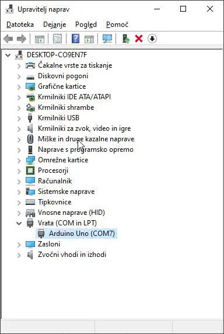

   > 💡 **En cas de problème :**
   > - Essayez un autre câble USB
   > - Testez un port USB différent
   > - Redémarrez votre ordinateur
   > - Désinstallez et réinstallez les pilotes

## Utilisation de l'application

### Débogage et Téléversement

#### 1. Préparation et vérification
- **Vérification du matériel**
  1. Branchez l'Arduino UNO à votre ordinateur via le câble USB
  2. Vérifiez que la LED d'alimentation de l'Arduino est allumée
  3. Assurez-vous que tous les capteurs sont correctement connectés :
     - Capteur BME280 sur les pins I2C
     - Module SD sur les pins SPI
     - GPS sur les pins série

  <!--  -->

- **Vérification logicielle**
  1. Lancez l'application Station Météo
  2. Dans la section "Débogage et Téléversement", vérifiez le message de statut :
     - "En attente..." : L'application est prête
     - "Arduino non détecté" : Vérifiez le branchement USB
  
  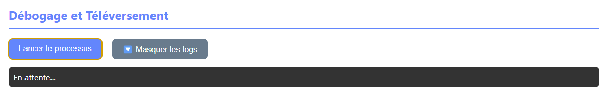

#### 2. Processus de téléversement
- **Étapes automatisées**
  1. **Initialisation du processus**
     - Détection de l'Arduino
     - Vérification de la connexion

  2. **Vérification des prérequis**
     - Détection du port COM
     - Test de communication

  3. **Installation des bibliothèques**
     - Vérification des bibliothèques nécessaires
     - Installation des bibliothèques manquantes :
       - DHT sensor library
       - Adafruit BME280
       - RTClib
       - SdFat
       - etc.

  4. **Compilation**
     - Préparation du code source
     - Compilation pour Arduino UNO

  5. **Téléversement**
     - Transfert du programme vers l'Arduino
     - Vérification du téléversement

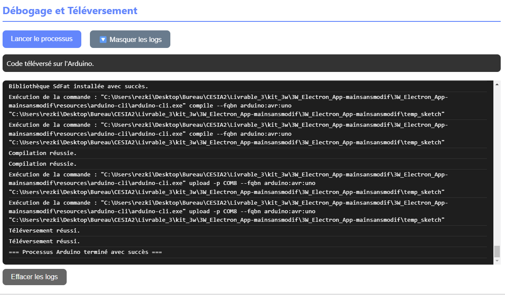

#### 3. Interprétation des logs
- **Messages courants**
  - `=== Démarrage du processus Arduino ===` : Début du processus
  - `Arduino détecté sur le port: COM[X]` : Connexion réussie
  - `Bibliothèque [nom] installée avec succès` : Installation des dépendances
  - `Code compilé avec succès` : Compilation réussie
  - `=== Processus Arduino terminé avec succès ===` : Processus complet

- **Messages d'erreur**
  - `Arduino non détecté` : Vérifiez la connexion USB
  - `Erreur lors de la compilation` : Problème de code source
  - `Échec du téléversement` : Problème de communication
  - `Erreur: Bibliothèque [nom] non trouvée` : Bibliothèque manquante

> 💡 **Astuce** : Utilisez le bouton "Masquer/Afficher les logs" pour gérer l'affichage des informations détaillées. Le bouton "Effacer les logs" permet de nettoyer l'historique des messages.

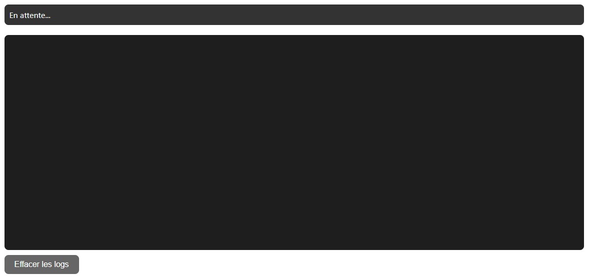

### Récupération des Données

#### 1. Extraction des données
- **Récupération de la carte SD**
  1. Éteignez la station météo
  2. Retirez la carte SD du module
  3. Insérez la carte SD dans votre ordinateur
  4. Localisez le fichier `DATA.BIN` à la racine de la carte
  
  > ⚠️ **Important** : Ne modifiez pas le fichier .BIN directement

  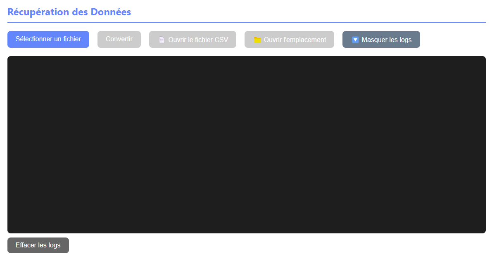

#### 2. Conversion des données
- **Processus de conversion**
  1. Dans l'application, cliquez sur "Sélectionner un fichier"
  2. Choisissez le fichier `DATA.BIN` récupéré
  3. Cliquez sur "Convertir"
  4. Attendez la fin de la conversion
  5. Un message "Conversion terminée avec succès" s'affichera

  > 💡 **Note** : Le fichier CSV sera créé dans le même dossier que le fichier .BIN

- **Actions disponibles après conversion**
  - "📄 Ouvrir le fichier CSV" : Ouvre directement le fichier
  - "📁 Ouvrir l'emplacement" : Ouvre le dossier contenant le fichier

<!--  -->

#### 3. Structure des données
- **Format du fichier CSV**
  Les colonnes du fichier sont organisées comme suit :
  - `Date` : Date de la mesure (JJ/MM/AAAA)
  - `Heure` : Heure de la mesure (HH:MM:SS)
  - `Temperature` : En degrés Celsius
  - `Humidite` : En pourcentage
  - `Pression` : En hectopascals
  - `Altitude` : En mètres
  - `Latitude` : Position GPS
  - `Longitude` : Position GPS

- **Exemple de données**
  ```csv
  Date,Heure,Temperature,Humidite,Pression,Altitude,Latitude,Longitude
  01/03/2024,14:30:22,23.5,65,1013.2,102,48.8566,2.3522
  ```
  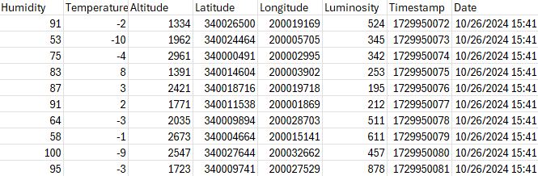

> 💡 **Astuce** : Pour une meilleure visualisation dans Excel :
> - Sélectionnez toutes les données
> - Onglet "Données" > "Convertir"
> - Choisissez le format "Délimité" > "Virgule"

## Guide de dépannage avancé

### Problèmes courants et solutions

1. **Erreurs de téléversement**
   - **Table des codes d'erreur**

| Code d'erreur | Description | Solution |
|--------------|-------------|-----------|
| `Arduino non détecté` | L'Arduino n'est pas reconnu par le système | - Vérifiez le branchement USB<br>- Essayez un autre port USB<br>- Réinstallez les pilotes |
| `Échec de compilation` | Erreur lors de la compilation du code | - Vérifiez que toutes les bibliothèques sont installées<br>- Consultez les logs pour plus de détails |
| `Erreur de communication` | Problème de communication avec l'Arduino | - Vérifiez que l'Arduino n'est pas utilisé par un autre programme<br>- Redémarrez l'application |
| `Bibliothèque manquante` | Une bibliothèque requise n'est pas installée | - Vérifiez la liste des bibliothèques requises :<br>  • DHT sensor library<br>  • Adafruit BME280<br>  • RTClib<br>  • SdFat<br>  • etc. |

> 💡 **Exemples de messages d'erreur dans l'interface :**
> ```
> === ERREUR ===
> • Arduino non détecté sur le port COM
> • Échec de l'installation de la bibliothèque DHT sensor
> • Erreur de compilation : variable non déclarée
> • Erreur de téléversement : port COM occupé
> === FIN ERREUR ===
> ```

#### 2. Problèmes de conversion
- **Erreurs courantes de conversion**

| Problème | Cause possible | Solution |
|----------|---------------|-----------|
| `Fichier .BIN non trouvé` | Le fichier n'est pas à la racine de la carte SD | - Vérifiez l'emplacement du fichier DATA.BIN<br>- Assurez-vous que le fichier n'a pas été renommé |
| `Erreur de lecture` | Fichier corrompu ou incomplet | - Vérifiez l'intégrité du fichier<br>- Essayez de récupérer une copie de sauvegarde |
| `Dossier converted_files inaccessible` | Problème de permissions | - Vérifiez les droits d'accès<br>- Exécutez l'application en tant qu'administrateur |
| `Format de données invalide` | Version incompatible ou données corrompues | - Vérifiez la version du firmware de la station<br>- Assurez-vous que la carte SD n'a pas été retirée pendant l'enregistrement |

> 💡 **Exemples de messages d'erreur de conversion :**
> ```
> === ERREUR DE CONVERSION ===
> • Erreur : Aucun fichier sélectionné
> • Erreur lors de la conversion : Fichier DATA.BIN non trouvé
> • Erreur : Format de données invalide à l'offset 0x1234
> • Erreur : Impossible de créer le dossier converted_files
> === FIN ERREUR ===
> ```

> 💡 **Astuce** : En cas d'échec de conversion, consultez les logs détaillés dans le dossier `logs/` de l'application.

### Maintenance préventive

1. **Vérifications régulières**
   - Liste de contrôle mensuelle
   - Points de maintenance

2. **Mises à jour**
   - Procédure de mise à jour
   - Vérification des versions

## Ressources supplémentaires

### Liens utiles
- [Documentation technique](https://github.com/mr22206/3W_Electron_App/blob/main/documentation/documentation_technique.md)
- [GitHub](https://github.com/mr22206/3W_Electron_App) - Code source de l'application
- [Documentation Arduino](https://www.arduino.cc/reference/fr/) - Documentation officielle Arduino
- [Forum Arduino](https://forum.arduino.cc/c/french/22) - Forum officiel Arduino en français
- [Tutoriels vidéo](https://www.youtube.com/playlist?list=PLKxVGO5_JZQBZoQFYwTFuUfDDYrIrYrB2) - Chaîne YouTube Arduino en français
- [Support technique](mailto:support@stationmeteo.fr) - Contactez notre équipe technique

> 💡 **Note** : Pour toute question spécifique sur l'application, consultez d'abord la [FAQ](faq.md) ou contactez le support technique.


© 2024 Station Météo Embarquée - Tous droits réservés
